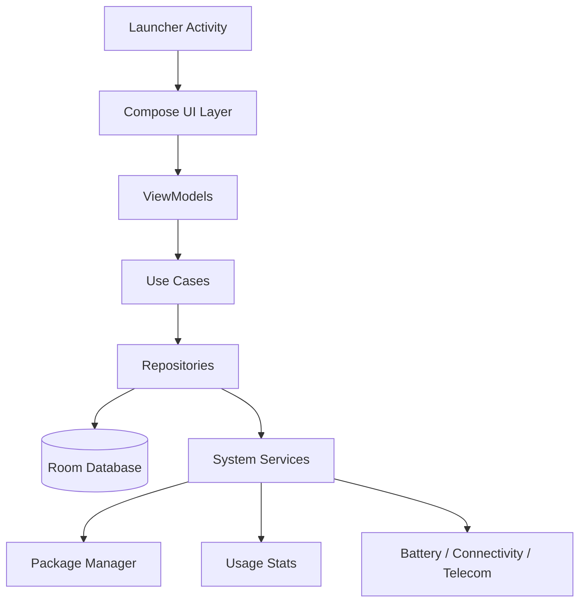

# Calm Launcher

A minimalist Android launcher inspired by the UI philosophy of the Light Phone III, built to reduce distraction and make the phone feel calm, monochrome, and intentional.

## Product Vision

Calm Launcher is a launcher for people who want less phone, not more phone. It removes visual noise, hides addictive surfaces by default, and replaces infinite feeds with a typography-first interface that feels closer to an e-ink device than a modern attention engine.

The design goal is simple:

- Pure black, white, and grayscale only
- No app icons, badges, colorful UI, reels, or recommendations
- Large readable text and generous spacing
- Fast, lightweight, battery-efficient, and Android 14 compatible
- Every interaction should feel deliberate, slow, and calm

## Proposed Stack

- Language: Kotlin
- UI: Jetpack Compose
- Architecture: MVVM
- Local persistence: Room
- Dependency injection: Hilt
- Background work: WorkManager
- Optional accessibility integration: Accessibility Services
- Default home support: Android launcher intent filters and home-role prompts

This stack keeps the launcher native, efficient, and easy to maintain on Android.

## Core Principles

1. Typography over icons
2. Monochrome only
3. Fewer choices, more intention
4. No feed mechanics
5. No motion unless it serves clarity
6. Default to calm, not convenience
7. Make distracting actions harder than intentional ones

## Core Features

### 1. Home Screen

The home screen shows only the essentials:

- Time
- Date
- Battery percentage
- Signal and Wi-Fi state
- Optional compact weather text

Rules:

- No widgets
- No wallpapers other than solid black or white
- No app grid
- No colorful surfaces
- No animations beyond soft fades

### 2. App System

Only these built-in tools are exposed by default:

- Phone
- Messages
- Alarm
- Calculator
- Calendar
- Camera
- Maps
- Notes
- Music
- Settings

All other apps remain hidden unless explicitly allowed.

### 3. Anti-Distraction Features

- Text labels instead of icons
- Optional 2 to 5 second opening delay for distracting apps
- Daily screen-time counter
- Confirmation prompt before opening addictive apps
- Locking options using long press, PIN, or explicit confirmation
- Greyscale enforcement
- Removal of infinite scroll wherever possible

### 4. UI Style

Visual language references:

- Light Phone OS
- Nothing-style restraint
- Old Kindle interfaces
- Monochrome Swiss typography
- Brutalist spacing and structure

Typography stack:

- Inter
- IBM Plex Sans
- Helvetica Neue

UI rules:

- Large readable text
- Thin dividers
- Slightly rounded corners only
- Soft fade transitions only
- No flashy motion or playful micro-interactions

### 5. Navigation

Primary interaction model:

- Vertical list-based navigation
- Swipe down for search
- Swipe left and right for tools
- Long press home for focus mode
- Gesture-first, but still accessible and predictable

### 6. Focus Mode

Focus mode blocks distracting apps and reduces the screen to a minimal state.

Includes:

- Hard app blocking
- Emergency bypass only
- Calming quotes or blank screen
- Optional minimalist timer

### 7. Security and Restrictions

The launcher should support strong guardrails:

- Prompt to become the default home app
- Reduce accidental exiting
- Optional kiosk mode
- Optional hidden status bar
- PIN-protected settings

## Architecture



### Layer Breakdown

- UI layer: Compose screens, gesture handling, typography system, transitions
- ViewModel layer: screen state, app filtering, focus mode state, settings state
- Domain layer: app eligibility rules, delay logic, screen-time policies, lock policies
- Data layer: Room entities, settings storage, usage records, app allowlist/denylist
- System layer: Android launcher APIs, accessibility, usage stats, and system status signals

## Suggested Folder Structure

```text
app/
  src/main/
    AndroidManifest.xml
    java/com/calmlauncher/
      MainActivity.kt
      launcher/
        LauncherActivity.kt
        DefaultHomePrompt.kt
        HomeRoleManager.kt
      ui/
        theme/
          Color.kt
          Type.kt
          Shape.kt
          Theme.kt
        components/
          TextRow.kt
          ThinDivider.kt
          CalmButton.kt
          ConfirmationSheet.kt
          DelayOverlay.kt
        screens/
          HomeScreen.kt
          AppListScreen.kt
          SearchScreen.kt
          FocusModeScreen.kt
          SettingsScreen.kt
          ToolScreen.kt
      viewmodel/
        HomeViewModel.kt
        AppListViewModel.kt
        FocusModeViewModel.kt
        SettingsViewModel.kt
      domain/
        models/
          AppEntry.kt
          FocusModePolicy.kt
          ScreenTimeRecord.kt
        usecase/
          FilterAppsUseCase.kt
          ShouldDelayOpenUseCase.kt
          ShouldShowConfirmationUseCase.kt
          BuildHomeStateUseCase.kt
      data/
        db/
          CalmDatabase.kt
          AppDao.kt
          SettingsDao.kt
          ScreenTimeDao.kt
          entity/
            AppEntity.kt
            SettingsEntity.kt
            ScreenTimeEntity.kt
        repository/
          AppRepository.kt
          SettingsRepository.kt
          ScreenTimeRepository.kt
        system/
          LauncherSystemObserver.kt
          UsageStatsTracker.kt
          BatteryObserver.kt
          NetworkObserver.kt
          WeatherProvider.kt
      accessibility/
        GreyscaleAccessibilityService.kt
        FocusBlockService.kt
      navigation/
        Routes.kt
        LauncherNavHost.kt
      utils/
        TimeFormatter.kt
        IntentBuilders.kt
        MonochromePalette.kt
```

## Screen Map

### Home Screen

Shows time, date, battery, connectivity, and optional weather in a sparse vertical layout.

### App List Screen

A text-only vertical list of allowed apps.

### Search Screen

A restrained search surface invoked by swipe down.

### Focus Mode Screen

A blank or quote-based shield screen that blocks distracting apps.

### Settings Screen

PIN-protected settings for whitelist control, delays, greyscale enforcement, and kiosk options.

### Tool Screens

Dedicated text-based screens for Phone, Messages, Alarm, Calculator, Calendar, Camera, Maps, Notes, Music, and Settings.

## State Management

Recommended state pattern:

- StateFlow for UI state
- Immutable screen models
- One-way data flow
- Repository-backed persistence
- Small, testable use cases for app filtering and lock policies

Example state categories:

- Home state
- App visibility state
- Focus mode state
- Lock / PIN state
- Screen-time state
- Accessibility and restriction state

## UI Behavior Rules

- App launch surfaces must be text-only
- No icon badges or notification bubbles
- No infinite scrolling surfaces
- No recommendation feeds
- No colorful media previews
- No distracting motion on screen changes
- Preserve immediate access to emergency functions

## Sample Launch Intent Logic

The launcher should intercept home presses, expose only allowed apps by default, and route all launches through policy checks.

Pseudo-flow:

1. User taps an app label
2. Launcher checks app category and lock policy
3. If distracting, show confirmation or delay overlay
4. If allowed, launch the app
5. Record screen-time and session metadata locally

## Minimal Theme Direction

The theme should emulate e-ink and Swiss design:

- Background: black or white
- Text: grayscale only
- Emphasis: size, spacing, and hierarchy, not color
- Dividers: thin and low-contrast
- Corners: subtle rounding only
- Shadows: none or nearly none

## Implementation Milestones

1. Scaffold the project and launcher manifest
2. Build the monochrome theme system
3. Implement the home screen
4. Add allowed-app filtering and text-only app list
5. Add search and gesture navigation
6. Add focus mode and restrictions
7. Add PIN-protected settings and screen-time tracking
8. Harden default-home, kiosk, and accessibility behavior
9. Polish typography, spacing, and performance

## Non-Goals

- Social feeds
- App store replacement
- Cloud sync as a requirement
- Rich personalization that encourages tinkering
- Visual complexity
- Anything that reintroduces attention traps

## Deliverables To Build Next

- Full launcher architecture
- Flutter or Compose implementation files
- Home screen sample code
- Navigation system
- Theme system
- App filtering logic
- Focus mode implementation
- Local persistence layer
- Accessibility support

## License

To be decided.
